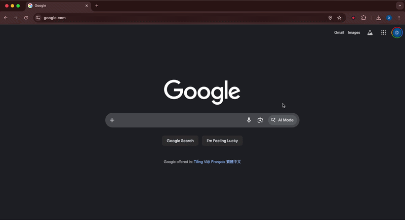

# Randall

A Chrome extension that records any browser tab. Click to start, click to stop.



## What it does

- **Record any tab** — capture video and audio from the tab you're on
- **Switch tabs freely** — the recording keeps going in the background
- **Pick your quality** — Low, Mid, or High
- **Choose where to save** — pick a folder, or let it download automatically
- **Never lose a recording** — if Chrome crashes, Randall recovers your footage on restart
- **Clean filenames** — files are named after the tab title with a timestamp

## Install

```bash
git clone https://github.com/datdao/randall.git
cd randall
```

1. Open `chrome://extensions` in Chrome
2. Enable **Developer mode** (top-right toggle)
3. Click **Load unpacked** → select the `extension/` folder
4. Pin Randall from the puzzle-piece menu

## Usage

1. Go to the tab you want to record
2. Click the **Randall** icon → pick quality → hit **Record this tab**
3. A red **REC** badge appears — browse normally, switch tabs, do your thing
4. Click Randall again → **Stop & Save**
5. Your `.webm` file is saved

---

## Development

Everything runs in Docker — no local Node.js needed.

```bash
make dev        # launch Chrome with extension in isolated profile
make test       # run tests in Docker
make test-watch # tests in watch mode
make lint       # ESLint in Docker
make clean      # remove temp Chrome profile
```

## How it works

1. The popup sends `start`/`stop` messages to a background service worker
2. The service worker gets a `tabCapture` stream and spins up an offscreen document
3. The offscreen document runs a `MediaRecorder`, buffering chunks to IndexedDB every second
4. On stop, chunks become a WebM file — saved to your chosen folder or downloaded
5. On crash/restart, unsaved chunks are recovered automatically

## Project structure

```
extension/
├── manifest.json        Chrome Manifest V3 config
├── service-worker.js    Recording orchestration + state
├── offscreen.html/js    MediaRecorder + crash-safe buffering
├── popup.html/js/css    UI controls
└── choose-folder.*      Folder picker

test/
└── service-worker.test.js

Dockerfile / docker-compose.yml / Makefile
```

## License

MIT
